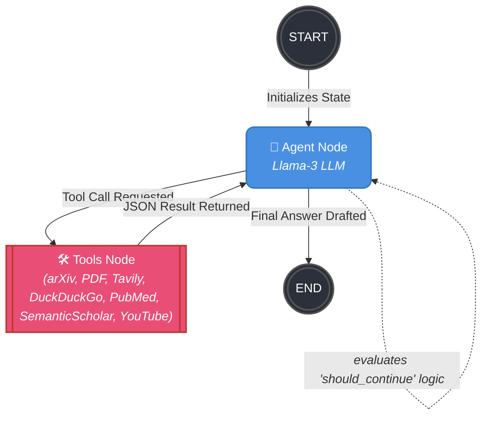

# AI Researcher: LangGraph Architecture

This diagram shows the complete node and edge structure of the compiled agent graph.
You can preview this file natively in VS Code or GitHub to see the drawn diagram.

